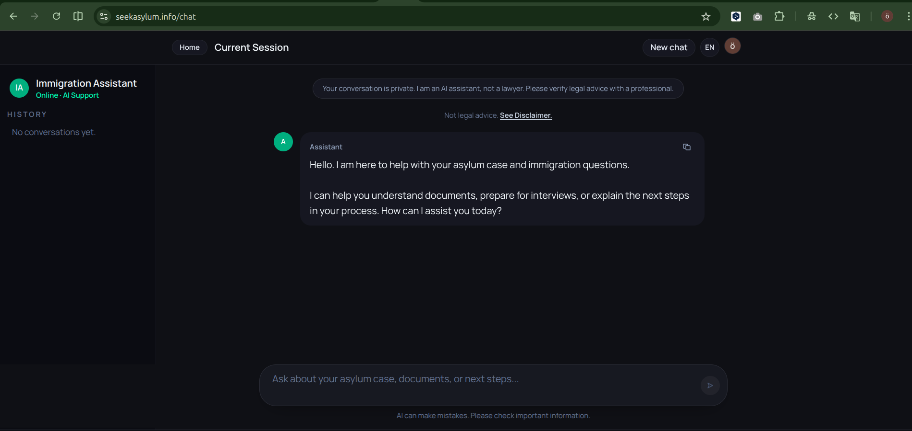

# Asylum Assistant

Asylum Assistant is a production-ready AI application built with a Retrieval-Augmented Generation (RAG) architecture to provide reliable, context-aware information about the UK asylum and immigration process.

The system retrieves relevant content from curated and trusted sources, then generates responses using a large language model grounded in that retrieved context. This approach improves factual accuracy and reduces hallucinations compared to standard prompt-only chat systems.

The application is designed as an informational support tool and does not provide legal advice.

## Screenshots




## Architecture Overview

- Frontend: React + Vite, with Clerk for authentication
- Backend: Node.js (Express) API with MongoDB
- AI Layer:
  - Semantic retrieval using vector embeddings
  - Context selection and prompt assembly
  - Response generation via OpenAI models
- Deployment:
  - Backend served behind a reverse proxy
  - Secure environment configuration
  - Public access limited to HTTPS endpoints

## Key Features

- Retrieval-Augmented Generation (RAG) pipeline for grounded answers
- Secure user authentication and access control
- Usage limits to manage cost and prevent abuse
- Chat-based interface focused on clarity and accessibility
- Health check endpoint for production monitoring

## Project Structure

```text
frontend/   # Client application (React + Vite)
backend/    # API, RAG pipeline, database, and auth logic
```

## Local Development (Optional)

### Backend

```bash
cd backend
npm install
npm start
```

### Frontend

```bash
cd frontend
npm install
npm run dev
```

## Deployment Notes

- The backend is designed to run behind a reverse proxy (e.g. Nginx).
- Only ports 80 and 443 should be exposed publicly.
- All sensitive configuration is managed via environment variables and is not committed to source control.

## Disclaimer

This application provides general informational support only and does not constitute legal advice. Users should consult qualified legal professionals for case-specific guidance.
